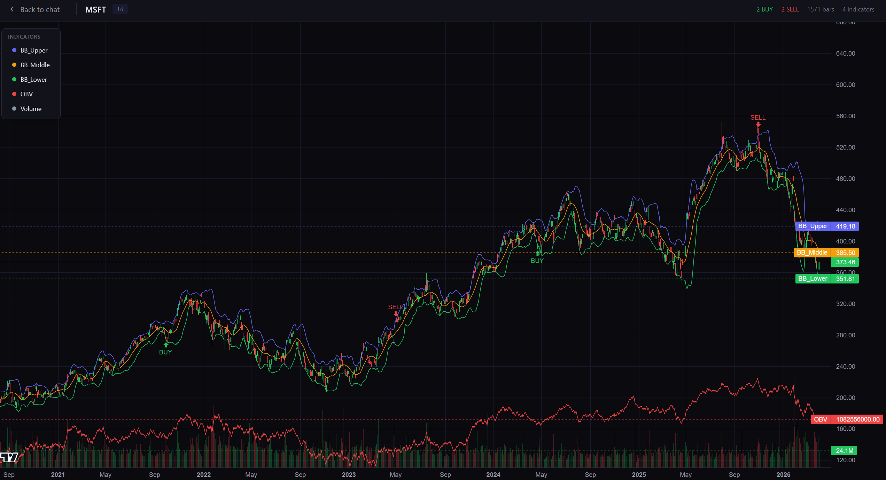
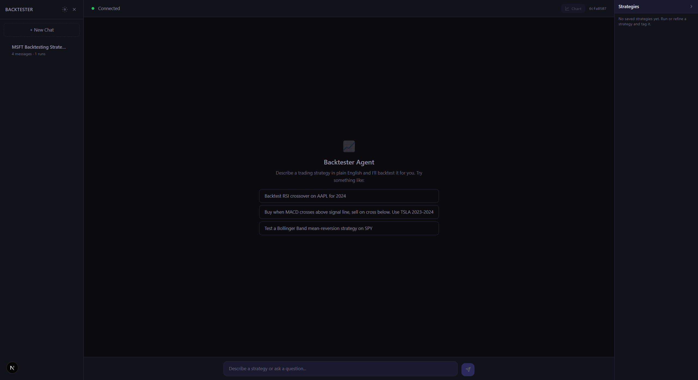
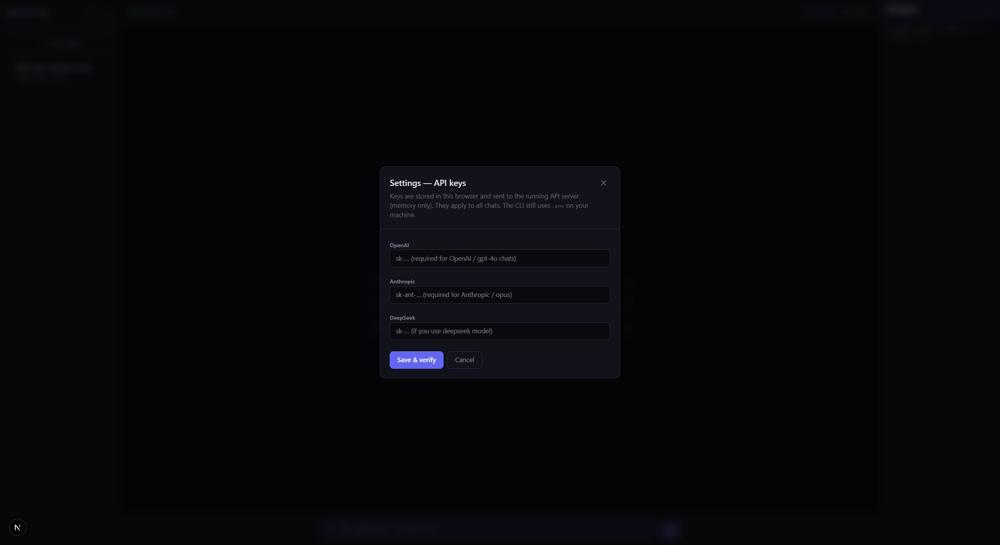
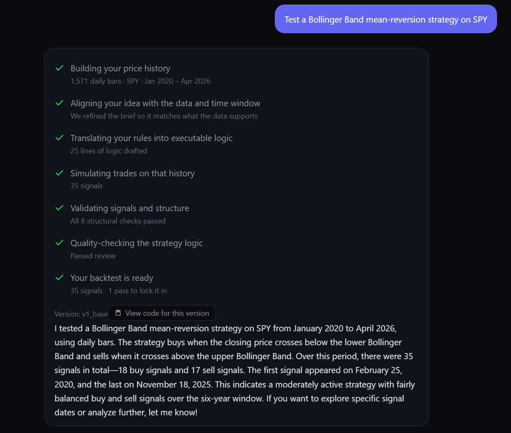
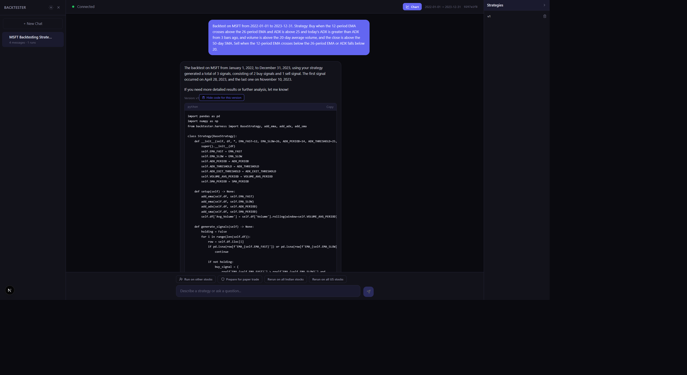
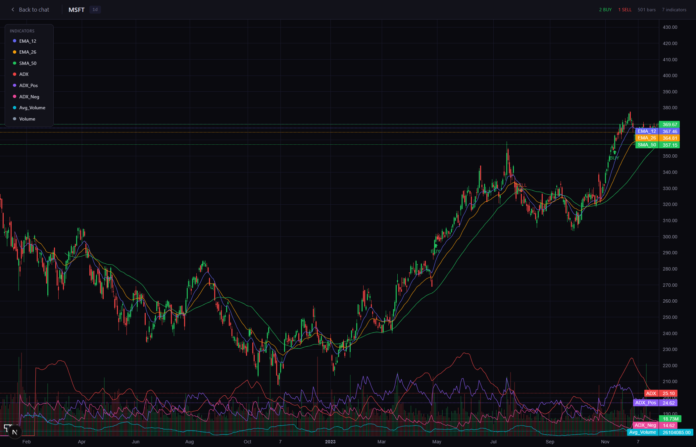
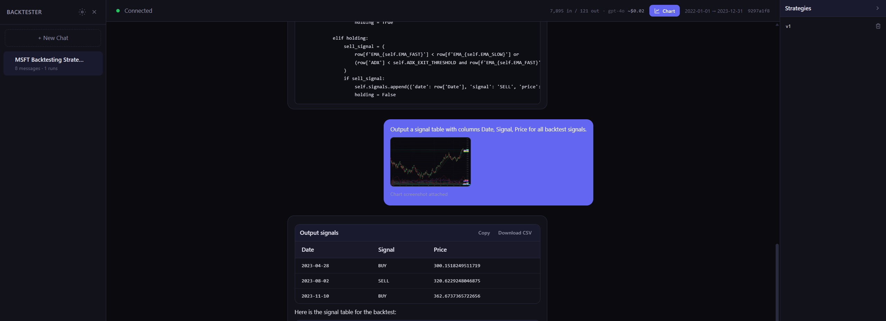
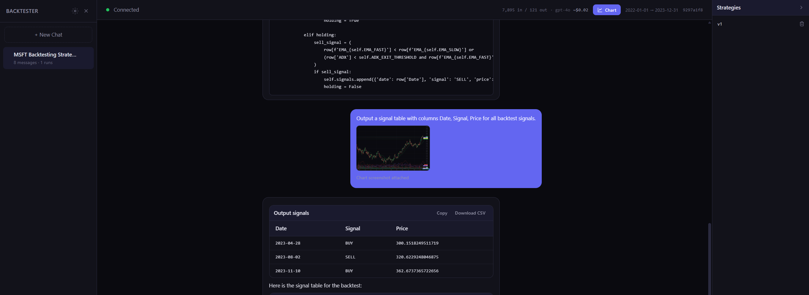

# Trading Copilot

**Natural-language → executable backtests.** Describe a trading idea in plain English; an LLM generates a small `Strategy` class, runs it on historical OHLCV (via [yfinance](https://github.com/ranaroussi/yfinance)), and iterates until you get coherent buy/sell signals. A **Next.js** UI and **FastAPI** backend provide a chat-style copilot; the same engine powers the **CLI**.

[](https://www.python.org/downloads/)
[](LICENSE)

The Python package is **`backtester`** (`pip install -e .`, see `pyproject.toml`).

[Workflow](#workflow-like-claude-code-for-trading-strategies) · [Run with Docker](#run-with-docker) · [Run manually](#run-manually-backend--frontend) · [Web app](#web-app) · [CLI](#cli-quick-start) · [Corporate examples](#corporate-strategy-examples) · [How it works](#how-it-works) · [LLM keys](#llm-providers)

<p align="center">
  
</p>

---

## Workflow: like Claude Code for trading strategies

Think of Trading Copilot as **Claude Code, but for trading strategies**: the AI turns your plain-language idea into executable backtest code, and you steer it through concrete feedback. **Models can be wrong**—bad signals, edge-case bugs, or indicators that do not match what you meant—so the product is built for the same loop you use with agentic coding tools: you **run** a version, **inspect** what happened, and **send bugs or errors back in chat** (stack traces, weird dates, “too many buys in Q1,” etc.) to get a **corrected** strategy.

You are not guessing in the dark. Open the **chart** with **buy/sell markers** and **toggle the indicators** that your algorithm uses (moving averages, ADX, volume, and so on) so your report to the assistant is grounded in what you see on the price series. Each fix lands as a **new saved version**; **older versions stay** in the workspace so you can compare code, rerun an earlier variant, or keep iterating without losing history.

**Rerun** lets you exercise the **same** strategy on another **company (ticker)** or another **date range** without rewriting the prompt from scratch. After a successful run, you can also kick off **batch backtests across all supported US or Indian stocks** to get a **report-style view** of how the strategy behaved across the full universe the app covers (see the action chips in chat).

---

## Run with Docker

**Requires:** [Docker](https://docs.docker.com/get-docker/) with Compose.

From the **repository root**:

```bash
docker compose -f docker/docker-compose.yml up --build
```

- **App:** http://localhost:3000  
- **API (health check):** http://localhost:6700/api/health → `{"status":"ok"}`

**API keys:** Create a `.env` file in the **repo root** (next to `pyproject.toml`) with at least one of:

```env
OPENAI_API_KEY=...
ANTHROPIC_API_KEY=...
DEEPSEEK_API_KEY=...
```

Compose loads it into the backend container automatically. You can also set keys in the UI; those reset when the container restarts unless you use env vars.

**Port conflicts:** Edit `ports:` in `docker/docker-compose.yml`. If you change the **published** API port, rebuild the frontend with the correct API URL (see [docker/README.md](docker/README.md)).

More detail, persistence, and troubleshooting: **[docker/README.md](docker/README.md)**.

---

## Run manually (backend + frontend)

Use this when you want hot reload and a local Node/Python workflow.

### 1. Backend (FastAPI)

From the **repository root**, with Python 3.10+:

```bash
python -m venv .venv
# Windows: .venv\Scripts\activate
# macOS/Linux: source .venv/bin/activate

pip install -e .

cp backtester/.env.example backtester/.env
# Edit backtester/.env — add OPENAI_API_KEY, ANTHROPIC_API_KEY, and/or DEEPSEEK_API_KEY

uvicorn backtester.api.server:app --reload --port 6700
```

The dev frontend expects the API on **port 6700** (see `frontend/next.config.ts`). If you use another port, update the rewrite `destination` there (or set `NEXT_PUBLIC_*` for a production build).

**Check:** http://localhost:6700/api/health

### 2. Frontend (Next.js)

Second terminal:

```bash
cd frontend
npm install
npm run dev
```

**Open:** http://localhost:3070 (`npm run dev` uses port **3070** per `frontend/package.json`.)

**How traffic flows in dev:** Browser → Next on **3070**; `/api/*` is rewritten to `http://localhost:6700/api/*`. WebSockets for chat use **6700** directly (`NEXT_PUBLIC_WS_URL` in [frontend/.env.example](frontend/.env.example) if you need to override).

**Optional:** Copy `frontend/.env.example` to `frontend/.env.local` if your backend URL or WebSocket URL is non-default.

**Ngrok / single origin:** See [frontend/README.md](frontend/README.md) for `dev:proxy` (default port **3080**).

---

## Web app

The UI is a **chat workspace** tied to your FastAPI backend: you describe or refine strategies, inspect generated Python, open an interactive **chart**, and manage **saved strategy versions**. The screenshots below were taken in **Google Chrome** while running the stack locally (`uvicorn` + `npm run dev`). If you use Docker, the app is the same; only the URL changes (e.g. http://localhost:3000).

### Layout and workspace

**Sidebar:** session list (**+ New Chat**), per-session message/run counts, and **Settings** (API keys). **Main area:** connection status, **Chart** (after at least one backtest in that session), optional **date range** for the run, and the conversation. Starter prompts help you run a first backtest quickly.

<p align="center">
  
</p>

### API keys (OpenAI, Anthropic, DeepSeek)

Open **Settings** from the sidebar (gear icon). Paste **OpenAI**, **Anthropic**, and/or **DeepSeek** keys and click **Save & verify**. Keys are sent to your running API server and kept **in memory** there (they apply to all chats in that server process). The CLI continues to use `backtester/.env` on your machine.

<p align="center">
  
</p>

### Chat, backtest summary, and next steps

After a run, the assistant explains **signal counts**, dates, and plain-language results. Action chips let you **run the same strategy on other tickers**, **rerun on all US or Indian stocks** (batch flows), or start **paper-trade preparation** (reproducibility checks). You can keep asking questions in the same thread to tweak logic or interpret output. For the full **iterate-with-chart** workflow (errors in chat, preserved versions), see [Workflow: like Claude Code for trading strategies](#workflow-like-claude-code-for-trading-strategies).

<p align="center">
  
</p>

### Strategy versioning and generated code

Each saved result is labeled with a **version** (e.g. **v1**). Use **View code for this version** to expand the generated `Strategy` class, **Copy** it, or open the **Strategies** panel on the right to **rename**, **add a version to the chat** as the base for the next refinement, or manage rerun options. That loop is how you **improve logic** iteratively without losing earlier variants.

<p align="center">
  
</p>

### Chart view

**Chart** opens a **candlestick** view (TradingView Lightweight Charts) with **buy/sell markers**, bar count, and **toggleable indicators** (EMA, SMA, ADX, volume, etc.) so you can visually **debug** entries and exits against price.

<p align="center">
  
</p>

### Tables: copy and download CSV

When the assistant returns structured signal data, it is shown as a table with **Copy** (TSV) and **Download CSV**. Use this for spreadsheets, notebooks, or sharing. Follow-up messages can request different slices or formats; the agent may also attach a **chart screenshot** for multimodal context when refining behavior.

<p align="center">
  
</p>

### Usage line (tokens and rough cost)

Assistant replies can show **input/output token counts**, the **model** used (e.g. `gpt-4o`), and an **approximate USD** cost for that turn—useful for monitoring spend and debugging long conversations.

<p align="center">
  
</p>

---

## CLI quick start

Same venv as above (`pip install -e .` and `backtester/.env` with keys).

```bash
backtester run \
  --strategy "Buy when RSI < 30 and MACD crosses above signal line, sell when RSI > 70" \
  --ticker AAPL \
  --start 2020-01-01 \
  --end 2025-01-01 \
  --model deepseek
```

Or: `python -m backtester.cli run ...`

Default output: `./signals_{TICKER}.csv` plus run artifacts.

### Corporate strategy examples

OHLCV comes from **[yfinance](https://github.com/ranaroussi/yfinance)** (Yahoo Finance). If your natural-language strategy mentions **earnings**, **dividends**, or **stock splits**, the runner **auto-detects** that and fetches the matching corporate calendars, then merges columns such as `Is_Earnings_Day`, `Days_To_Earnings`, `EPS_Surprise_Pct`, `Dividend_Amount` / `Is_Ex_Dividend`, and `Split_Ratio` / `Is_Split_Day` into the same dataframe the strategy code sees. You do not pass a separate flag—the wording of `--strategy` drives it.

Below are three runnable examples (swap `--model` or tickers as you like). Longer lists of the same style live in [STRATEGIES.md](STRATEGIES.md) (corporate sections).

**1. Earnings — post-earnings drift with EPS surprise**

```bash
backtester run \
  --strategy "Buy on the first trading day after an earnings announcement if the EPS surprise percentage is positive (actual beat estimate). Sell 10 trading days later or when RSI exceeds 70, whichever comes first." \
  --ticker MSFT \
  --start 2020-01-01 \
  --end 2025-01-01 \
  --model deepseek
```

**2. Dividends — ex-dividend window**

```bash
backtester run \
  --strategy "Buy 3 trading days before an ex-dividend date and sell on the ex-dividend date. Only enter if the dividend amount is greater than zero and the 20-day SMA is above the 50-day SMA." \
  --ticker JNJ \
  --start 2020-01-01 \
  --end 2025-01-01 \
  --model deepseek
```

**3. Stock splits — forward split continuation**

```bash
backtester run \
  --strategy "Buy on the day of a stock split if the split ratio is greater than 1 (forward split) and the close is above the 20-day SMA. Sell 20 trading days later or when the close falls below the 20-day SMA." \
  --ticker NVDA \
  --start 2020-01-01 \
  --end 2025-01-01 \
  --model deepseek
```

### `run` — main flags

| Flag | Description | Default |
|------|-------------|---------|
| `--strategy` / `-s` | Natural-language strategy | — |
| `--strategy-file` / `-f` | File with strategy text | — |
| `--ticker` / `-t` | Symbol (e.g. `AAPL`) | **required** |
| `--start` / `--end` | `YYYY-MM-DD` | `2020-01-01` / `2025-01-01` |
| `--interval` | `auto` or `1m` … `1mo` | `auto` |
| `--model` / `-m` | `deepseek` \| `openai` \| `opus` | `deepseek` |
| `--max-iterations` / `-n` | Max codegen attempts | `10` |
| `--output` / `-o` | CSV path | `./signals_{ticker}.csv` |
| `--verbose` / `-v` | Print generated code | off |
| `--no-analyze` | Skip pre-flight analysis | off |

### `fix` — last run

```bash
backtester fix --issue "Too many buy signals in January 2023" --last-run
```

### `refine` — interactive edits

```bash
backtester refine --model deepseek
backtester refine --resume SESSION_ID
```

---

## What this is

- **Harnessed codegen:** The model only writes a `Strategy` subclass; indicators, runner, and tests are fixed in-repo.
- **Iteration:** Retries with richer context; optional pre-flight strategy analysis (`--no-analyze` to skip).
- **Corporate events:** Strategies that imply earnings/dividends/splits can trigger extra data (see [STRATEGIES.md](STRATEGIES.md)).
- **Not a broker** — research and signals only.

---

## How it works

```
┌─────────────────────────────────────────────────────────────┐
│  You: natural-language strategy + ticker + dates + interval   │
└───────────────────────────┬─────────────────────────────────┘
                            ▼
┌─────────────────────────────────────────────────────────────┐
│  Data: yfinance OHLCV (+ optional corporate event columns)   │
└───────────────────────────┬─────────────────────────────────┘
                            ▼
┌─────────────────────────────────────────────────────────────┐
│  Optional: strategy analysis (revise wording / interval)    │
└───────────────────────────┬─────────────────────────────────┘
                            ▼
┌─────────────────────────────────────────────────────────────┐
│  LLM: emit Strategy subclass (harness runs tests)           │
└───────────────────────────┬─────────────────────────────────┘
                            ▼
┌─────────────────────────────────────────────────────────────┐
│  Iteration: execute → errors → enriched retry               │
└───────────────────────────┬─────────────────────────────────┘
                            ▼
                 signals CSV + run artifacts
                            │
         ┌──────────────────┴──────────────────┐
         ▼                                     ▼
   CLI: fix / refine                    Web: chat + reruns
```

REST lives under **`/api`**; the agent uses WebSockets on the same host/port as the API.

---

## LLM providers

| `--model` | Environment variable |
|-----------|----------------------|
| `deepseek` | `DEEPSEEK_API_KEY` |
| `openai` | `OPENAI_API_KEY` |
| `opus` | `ANTHROPIC_API_KEY` |

Optional: `DEFAULT_MODEL`, `MAX_ITERATIONS` in `backtester/.env` ([backtester/.env.example](backtester/.env.example)).

---

## More docs

| Doc | Contents |
|-----|----------|
| [STRATEGIES.md](STRATEGIES.md) | 110+ example natural-language strategies |
| [docker/README.md](docker/README.md) | Compose details, volumes, troubleshooting |
| [frontend/README.md](frontend/README.md) | Dev proxy / ngrok notes |

---

## Disclaimer

For **education and research** only. Not financial advice. You are responsible for data terms, broker rules, and applicable law.

---

## License

MIT — [LICENSE](LICENSE).
